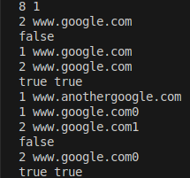
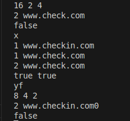

# AP-Email
link to repo - 
https://github.com/OmerElmaliach/AP-Email

link to jira -
https://omerelmaliachprivate.atlassian.net/jira/software/projects/AE/summary

the flow process of our work and SCRUM meeting summaries can all be found under the user story "Manage project process"

## Overview

This project implements a URL filtering system using a Bloom filter. The system allows users to add and remove URLs to a blacklist and check if a given URL is potentially blacklisted. It leverages the speed and memory efficiency of Bloom filters to quickly determine potential membership in the blacklist. The communivation is done through a TCP protocol server/client implementation.

## Architecture

The system follows the structure outlined in the provided UML diagrams:


* **main()**: Entry point, initializes server.
* **App**: Manages the application flow and uses the `CLI`.
* **CLI**: Provides the command-line interface, allowing users to `addURL` and `checkURL`. It utilizes the `BloomFilter` and `BloomFilterStorage`. Works through the server's connection.
* **BloomFilter**: The core probabilistic data structure. It uses `myHash` for hashing URLs and provides `insert` and `query` operations.
* **myHash**: Provides the hashing function(s) needed by the `BloomFilter`.
* **BloomFilterStorage**: Handles saving and loading the Bloom filter state to persistent storage (extending `FileStorage`).
* **FileStorage**: Implements the `IStorage` interface for file-based persistence.
* **IStorage**: Interface defining `save`, `load` etc. operations.
* **ICommand**: Interface for command pattern implementation (e.g., `AddURL`, `CheckURL`).
* **AddURL / CheckURL / DeleteURL**: Concrete command classes implementing `execute` based on the `ICommand` interface.
* **Server** - handles the connection with the client, data storage and app running.
* **client** - runs the client side whcih passes commands through the socket.

## How it Works

1.  **Initialization**: On startup, the server loads any previously saved Bloom filter state from storage and waits for a connection with an available client. The port, Bloom filter's size and the hash functions used are configured initially.
2.  **Adding URLs (Blacklisting)**: When a user adds a URL via the `addURL` command, the URL is hashed multiple times using the configured hash functions. The bits in the Bloom filter array corresponding to the hash results are set to 1[cite: 20, 23]. The updated filter state is saved.
3.  **Checking URLs**: When a user checks a URL via the `checkURL` command, the URL is hashed using the same hash functions. The system checks if *all* corresponding bits in the Bloom filter array are set to 1.
    * If any corresponding bit is 0, the URL is definitively *not* blacklisted.
    * If all corresponding bits are 1, the URL *might* be blacklisted. Bloom filters can produce false positives (indicating a URL is blacklisted when it isn't) but never false negatives. These are checked manually through the URL storage in the bloomFilterStorage.
4. **Deleting URLs**: When a user wants to remove a URL from the storage, he uses `deleteURL` command. This removes the data from the storage, but does not change the bits in the filter.

## Setup & Running

**Prerequisites:** Docker must be installed and running.

**Using script:**

If you have the `start-server.sh` and `start-client.sh` scripts, you can run them directly:

```bash
chmod +x start-server.sh
./start-server.sh

*In a separate window:*

chmod +x start-client.sh
./start-client.sh
```
**Alternative: using a docker image directly:**
1.  **Build the Docker Image:**
    Open a terminal in the project's root directory (where `DockerMain` is located) and run:
    ```bash
    docker build -f config/DockerServer -t docker-server .
    docker build -f config/DockerClient -t docker-client .
    ```

2.  **Run the Application:**
    ```bash
    docker run -it --network=host -v "Ap-Email/data:/Ap_Email/data" docker-server {PORT} {BLOOM FILTER INPUT (example 8 2 1)}
    docker run -it --network=host docker-client {IP} {PORT}
    ```
    * The `-it` flags allow you to interact with the application (provide input).
    * The `--network=host` flag allows to access local host outside the docker.
    * The application expects commands (`POST [URL]` to add, `GET [URL]` to check and `DELETE [URL]` to delete).

## Example Run:

Below is an example illustrating how the Bloom filter operates:







## Takeaways from task 1 relating to SOLID:
In general, lack of documentation harmed the ability to work and understand code which was written by other teammates in part Regarding the following questions:
1. Did changing command names change anything in code which was supposed to be SOLID? No, In the implementation a map data structure was initialized which receives a key value and pairs it with a specific ICommand object, so given input from the user the map would execute the relevant command.
In the new implementation with the new names all we had to do is change the key value from a number to string.
2. Did adding command names change anything in code which was supposed to be SOLID? No, as explained we conveniently just added more commands with keys to the map without altering any other code.
3. Did command output change anything in code which was supposed to be SOLID? Yes, before part 2 the commands never returned any output to the function that called them, more specifically the ICommands printed straight to the terminal instead of returning a string, in the new implementation we added return type so that regardless of what each command sent it would be delivered to the client.
4. Did commands coming from sockets rather than console change anything in code which was supposed to be SOLID? Partially. CLI which is the object type that handles I/O with a user was added a new member - sock -> the client socket, so instead of printing to a terminal the output from the commands would be sent to the client, the rest of the structure remained the same. The storage had to be updated to receive input from the socket and not tight-coupling with text from console.
