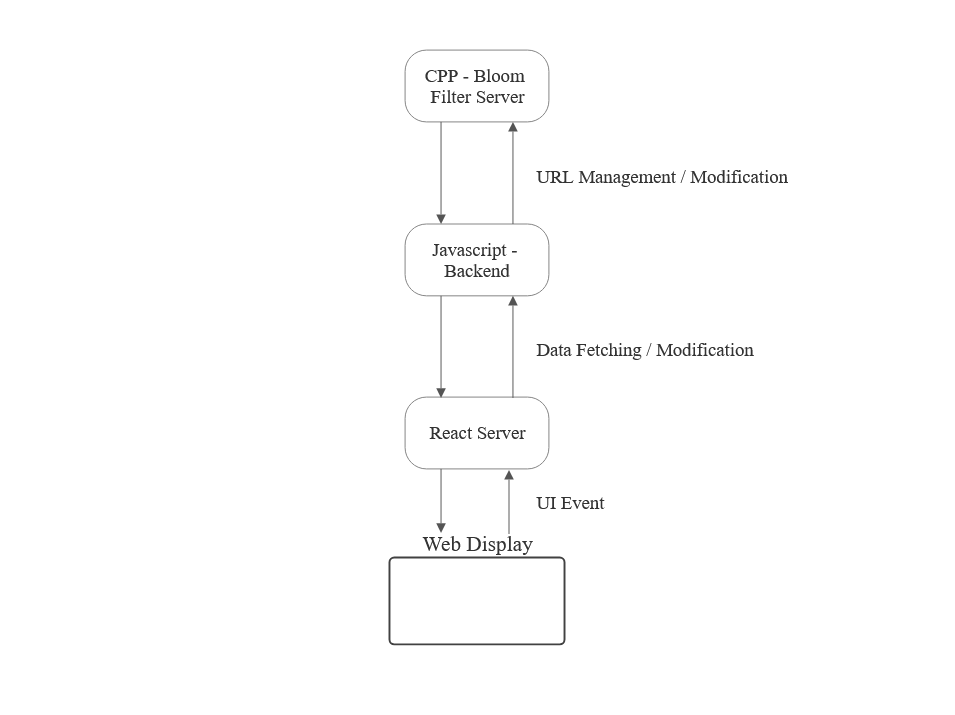
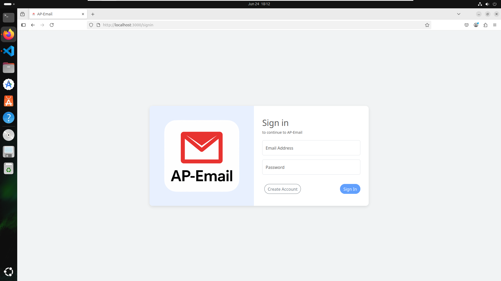
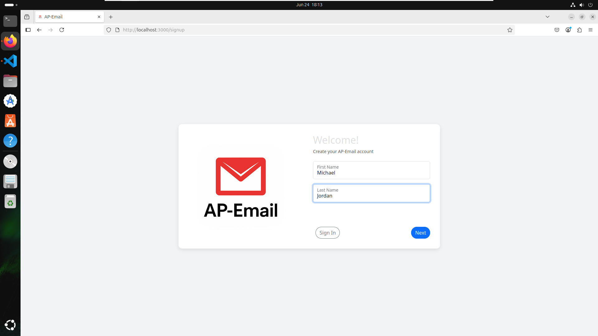
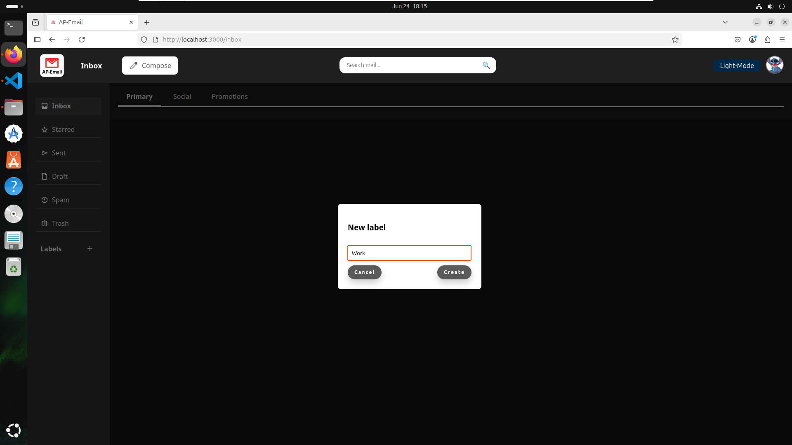
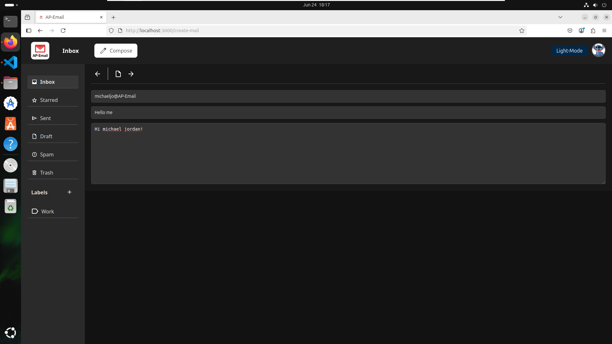

# AP-Email
link to repo - 
https://github.com/OmerElmaliach/AP-Email

link to jira -
https://omerelmaliachprivate.atlassian.net/jira/software/projects/AE/summary

the flow process of our work and SCRUM meeting summaries can all be found under the user story "Manage project process"

## Overview

**AP-Email** is a modern, full-stack web application that simulates a complete email system with advanced features for composing, sending, labeling, and managing emails. The system is built using a React frontend, a Node.js + Express backend, and a C++ TCP server that uses a Bloom filter to handle blacklisted URLs.

Key features include:
- Full user authentication (sign up, sign in)
- Email composition and sending with multi-recipient support
- Real-time blacklist checking for URLs in emails
- Label-based email organization (including system labels like “sent”, “trash”, and “draft”)
- Email draft saving and resuming
- Trash system with soft delete and permanent deletion
- Custom label creation, renaming, and removal
- Responsive and intuitive user interface

The project emphasizes modularity, scalability, and practical use of both RESTful APIs and interprocess communication across languages.


## Architecture

The system follows the structure outlined in the provided UML diagrams:


**C++ Blacklist Server Components:**
* **main()**: Entry point that initializes the server with port and Bloom filter parameters
* **Server**: TCP server that manages client connections, handles socket communication, and delegates processing to the App layer
* **App**: Application coordinator that creates and manages the CLI interface for each client connection
* **CLI**: Command-line interface that processes incoming commands (POST/GET/DELETE) and manages command registration
* **BloomFilter**: Core probabilistic data structure using multiple hash functions for efficient URL membership testing
* **MyHash**: Hash function provider supporting multiple hash algorithms for the Bloom filter
* **bloomFilterStorage**: Specialized storage manager handling persistence of Bloom filter data, URLs, and configuration
* **fileStorage**: File-based storage implementation providing save/load operations for persistent data
* **IStorage**: Storage interface defining standard operations (save, load, exists, remove)
* **ICommand Interface & Commands**: Command pattern implementation with AddURLCommand, CheckURLCommand, and DeleteURLCommand for modular operation handling

**JavaScript Email Server Components:**
* **JSApp**: Express.js application server running on port 9000, handling HTTP requests and routing
* **Routes Layer**: RESTful API endpoints for mails, blacklist, users, labels, and authentication tokens
* **Controllers Layer**: Business logic handlers that process HTTP requests and coordinate between routes and models
* **Models Layer**: Data access layer managing email operations, user management, and blacklist communication
* **BlacklistModel**: Specialized component that communicates with the C++ server via TCP sockets for URL validation

**React Frontend Components:**
* **App.js**: Root component that sets up routing and navigation using `react-router-dom`
* **SignIn / SignUp**: Authentication pages where users can register or log into the system
* **Inbox**: Displays all received and sent emails, grouped by labels
* **EmailDisplay**: Full-page view for reading a specific email
* **EmailCreate**: Compose new emails, with support for saving drafts and blacklisted URL validation
* **ProtectedRoute**: Wrapper component that guards routes and redirects unauthenticated users
* **ErrorPage**: Displayed for undefined routes (404)
* **Label System**: Integrated throughout the UI for applying, removing, and filtering emails by label
* **Draft Logic**: Embedded in `EmailCreate`, enabling users to save unfinished emails and resume later
* **Form Validation**: Real-time form behavior (e.g., adding @AP-Email domain, username restrictions)



## How it Works

### System Initialization
1. **Blacklist Server Startup**: The C++ server initializes on a specified port (default 8091) with Bloom filter parameters (size, hash functions, seeds)
2. **Data Persistence Loading**: Server loads previously saved Bloom filter state, URL storage, and configuration from persistent storage
3. **Email Server Startup**: JavaScript Express server starts on port 9000, establishing RESTful API endpoints
4. **frontend GUI**  The frontend is a React-based single-page application that provides a modern user interface for interacting with the AP-Email system. It communicates with the backend server via HTTP requests to fetch and manage emails, user accounts, labels, and more.
4. **Docker Network**: all services connect through a Docker bridge network enabling inter-container communication


Key responsibilities of the frontend include:

- **User Authentication**: Supports user sign-up and login. After authentication, a token is stored and used to access protected routes.
- **Routing**: Utilizes React Router to handle navigation between pages such as inbox, compose email, view email, and error pages.
- **Inbox & Email Management**: Displays received and sent emails, allows composing new messages, and opening full email views.
- **Label System**: Lets users create custom labels, assign them to emails, filter by label, and manage label metadata.
- **Draft Support**: Users can save emails as drafts, return to them later for editing, and send or delete them as needed.
- **Input Enhancements**: Includes input assistance like automatically appending domain suffixes and preventing invalid characters.

All communication between the frontend and backend is performed using standard REST API calls. The frontend is styled using CSS modules for consistent layout and responsive design.


## Setup & Running

**Prerequisites:** Docker must be installed and running.
### Method 1: Using Docker Compose (Recommended)

1. **Run the Complete System:**
   ```bash
   docker-compose up --build
   ```
   
2. **Access the Services:**
    - Email SignIn : `http://localhost:3000/SignUp` 
    - Email SignIn : `http://localhost:3000/SignIn` 
      
Users may only interact with the React frontend. Any attempt to access the backend directly will redirect them to the sign-in page.

3. **Stop the System:**
   ```bash
   docker-compose down
   ```

### Method 2: Manual Docker Setup (But why make life complicated?)

1. **Build Docker Images:**
   ```bash
   # Navigate to src directory
   cd src
   
   # Build blacklist server
   docker build -f config/DockerServer -t docker-server .
   
   # Build JavaScript server
   docker build -f config/DockerJs -t docker-js .
   ```

2. **Create Docker Network:**
   ```bash
   docker network create ap-email-net
   ```

3. **Run Blacklist Server:**
   ```bash
   # Create data directory for persistence
   mkdir -p ../data
   
   # Run blacklist server with Bloom filter settings: port=8091, size=32, hash_functions=2, seed=5
   docker run -d --name docker-server --network ap-email-net \
     -p 8091:8091 -v "$(pwd)/../data:/Ap_Email/data" \
     docker-server 8091 32 2 5
   ```

4. **Run JavaScript Email Server:**
   ```bash
   docker run -d --name docker-js --network ap-email-net \
     -p 9000:9000 docker-js
   ```

5. **Run React Frontend:**
   ```bash
   # Navigate to the react-server project folder 

   # Install dependencies
   npm install

   # Start the development server
   npm start
   ```

   The frontend will be accessible at `http://localhost:3000`

### Method 3: Using Provided Scripts

1. **Start Blacklist Server:**
   ```bash
   cd src
   chmod +x start-server.sh
   ./start-server.sh
   ```

2. **Start JavaScript Server (in separate terminal):**
   ```bash
   cd src
   chmod +x start-js-server.sh
   ./start-js-server.sh
   ```

## Screenshots

Here are some screenshots demonstrating key features of the AP-Email system.














**more Screenshots in ./readmeFiles**


